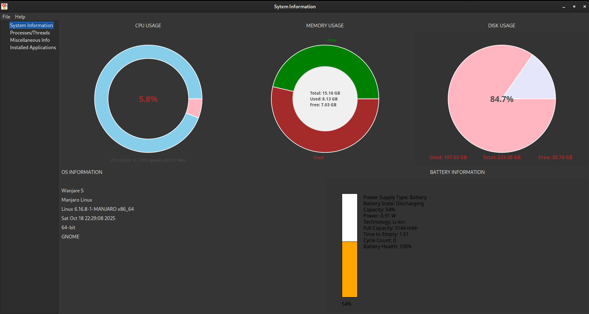
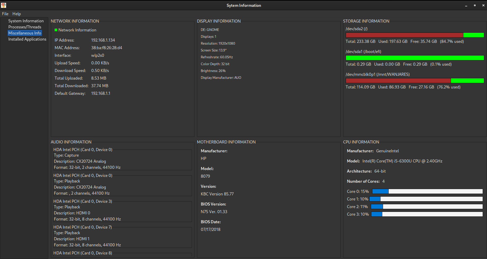
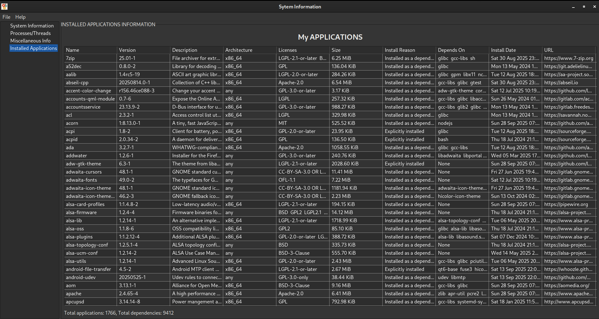

<div align="center">

</div>

<div align="center">

**<font color='green'>SysInfoViewer</font>**

**<font color='red'>A Simple and lightweight System Information Viewer for Linux.</font>**

</div>

---

### 📖 Table of Contents
* [👋 Introduction](#-introduction)
* [🎨 App Colors](#-app-colors)
* [📂 File Structure](#-file-structure)
* [🏗️ Core Components](#️-core-components)
  * [The `MyApp` Class](#the-myapp-class)
  * [The `MyFrame` Class](#the-myframe-class)
  * [System Information Page](#system-information-page)
  * [Resources Page](#resources-page)
  * [Miscellaneous Page](#miscellaneous-page)
  * [Applications Page](#applications-page)
* [🛠️ Build & Configuration](#️-build--configuration)
  * [`CMakeLists.txt`](#cmakeliststxt)
  * [`build.sh`](#buildsh)
  * [`compile_commands.json`](#compile_commandsjson)
* [🔄 Continuous Integration](#-continuous-integration)
* [📜 License](#-license)
* [🧩 Extending the API](#-extending-the-api)
* [📸 Screenshots](#-screenshots)

---

### 👋 Introduction

Welcome to the technical documentation for **SysInfoViewer**! This document provides a deep dive into the application's architecture, components, and development process. Whether you're a budding developer, a student, or just curious, this guide will walk you through the whys and hows of the project.

SysInfoViewer is a graphical application built with C++ and the [wxWidgets](https://www.wxwidgets.org/) library. It's designed to provide a comprehensive overview of your Linux system's hardware and software, from CPU and memory usage to detailed information about your display, network, and installed applications.

The application was originally developed and compiled on Manjaro Linux. To ensure broader compatibility, it is continuously tested on other major Linux distributions like Fedora and Ubuntu using GitHub Actions. This ensures that for most users, the app will work flawlessly out of the box.

### 🎨 App Colors

The application uses a specific color palette to create a consistent and visually appealing user interface. These colors are inspired by the app's logo and are used throughout the various charts and UI elements.

*   <font color="#A52A2A">**Dark Red**</font>
*   <font color="#006400">**Dark Green**</font>
*   <font color="#FF8C00">**Dark Orange**</font>
*   <font color="#36454F">**Dark Grey/Black**</font>

### 📂 File Structure

Here's a brief overview of the key files and directories in the project:

```
/
├── .github/                # GitHub Actions workflows for CI/CD
├── cmake/                  # CMake helper files
├── screenshots/            # Application screenshots
├── versions/               # Older versions of the source code
├── build.sh                # Script to build the application
├── CMakeLists.txt          # Main CMake build script
├── com.wanjaresamuel.SysInfoViewer.metainfo.xml # AppStream metadata
├── LICENSE                 # Project license file
├── README.md               # Project README
└── sysinfo.cpp             # Main application source code
```

---

### 🏗️ Core Components

The entire application logic is contained within `sysinfo.cpp`, making it a monolithic codebase. This design choice simplifies the build process and dependency management for this project's scale.

#### The `MyApp` Class
This is the entry point of the application. It inherits from `wxApp` and is responsible for initializing the main application window (`MyFrame`).

```cpp
class MyApp : public wxApp {
public:
  virtual bool OnInit();
};

wxIMPLEMENT_APP(MyApp);

bool MyApp::OnInit() {
  // ... initialization logic ...
  MyFrame *frame = new MyFrame();
  frame->Show(true);
  return true;
}
```

#### The `MyFrame` Class
This class represents the main window of the application. It inherits from `wxFrame` and sets up the primary UI structure, including the `wxTreebook` which is used for the main navigation.

The `wxTreebook` creates a navigation tree on the left side of the window, allowing the user to switch between different information pages.

```cpp
class MyFrame : public wxFrame {
public:
  MyFrame();
  // ... event handlers ...
};
```

The main window is divided into four primary pages:
1.  **System Information**
2.  **Resources**
3.  **Miscellaneous**
4.  **Apps**

Let's explore each page in detail.

---

#### System Information Page

This is the main dashboard, providing a real-time overview of the most critical system metrics. The page is split into a top and bottom row, each containing different informational panels.

##### `CPUDoughnutChartPanel` 🍩
This panel displays the current CPU usage as a dynamic doughnut chart.

*   **How it works:** It uses a `wxTimer` to periodically read CPU statistics from `/proc/stat`. By comparing the current and previous CPU idle and non-idle times, it calculates the usage percentage.
*   **Visualization:** The chart is custom-drawn using `wxGraphicsContext`. The used portion is colored light pink, and the available portion is sky blue. The center of the chart displays the usage percentage.

##### `MemoryDoughnutChartPanel` 🧠
Similar to the CPU panel, this one shows memory usage.

*   **How it works:** It reads memory information from the `sysinfo` struct, which provides total and free RAM.
*   **Visualization:** The used memory is shown in brown, and free memory is in green. The center of the chart provides a breakdown of total, used, and free memory in GB.

##### `DiskUsagePieChart` 💾
This panel displays the disk usage for the root filesystem (`/`).

*   **How it works:** It uses the `statvfs` function to get total, free, and used space on the filesystem.
*   **Visualization:** A pie chart shows the used (light pink) and free (lavender) space. The percentage of used space is displayed in the center.

##### OS Information 🐧
This section, located on the bottom-left, provides static information about the operating system, including:
*   Distribution Name (e.g., Manjaro, Ubuntu)
*   Kernel Version
*   Hostname
*   Current User
*   Desktop Environment

##### `BatteryInfoPanel` 🔋
For laptops, this panel on the bottom-right provides detailed battery information.

*   **How it works:** It reads various files from the `/sys/class/power_supply/BAT0/` directory to get the battery's status, capacity, charge level, health, and more.
*   **Visualization:** A vertical bar represents the battery level, with the color changing from green to orange to red as the battery depletes. Detailed text-based information is displayed alongside the bar.

---

#### Resources Page

This page provides a list of all running processes on the system, similar to the `top` or `htop` command-line utilities.

##### `ResourcesInfoPage` 📊
This is the main class for the resources page.

*   **How it works:** It executes the `ps aux --sort=-pcpu` command to get a list of all processes, sorted by CPU usage. The output is then parsed and displayed in a `wxListCtrl`.
*   **Features:**
    *   **Process List:** Shows PID, User, Name, CPU%, RAM%, and the full command.
    *   **Refresh:** A "Refresh" button allows the user to update the process list at any time.
    *   **Total Processes:** Displays the total number of running processes.

---

#### Miscellaneous Page

This page contains more specific hardware information, organized into several panes.

##### `NetworkInfoPanel` 🌐
Displays real-time network information.

*   **How it works:** It uses `getifaddrs` to find active network interfaces and reads from `/proc/net/dev` to calculate upload and download speeds.
*   **Information Displayed:** IP Address, MAC Address, Interface Name, Upload/Download Speed, and Total Data Transferred.

##### `DisplayInfoPanel` 🖥️
Provides detailed information about the connected display(s).

*   **How it works:** It uses a combination of `xrandr`, `wxDisplay`, and direct parsing of `/sys/class/backlight` and DRM properties to gather information.
*   **Information Displayed:** Resolution, Refresh Rate, Color Depth, Brightness, and Manufacturer/Model information parsed from EDID data.

##### `StorageDevicesPanel` 💽
Lists all mounted storage devices and their usage.

*   **How it works:** It parses `/proc/mounts` to find all mounted block devices (like `/dev/sda1`) and then uses `statvfs` for each one to get usage statistics.
*   **Visualization:** Each device is listed with its name, mount point, and a custom progress bar showing the used space, along with text detailing the total, used, and free space in GB.

##### `AudioDevicesPanel` 🔊
Lists all detected audio devices (both playback and capture).

*   **How it works:** It uses the ALSA (Advanced Linux Sound Architecture) library (`libasound`) to enumerate sound cards and their associated devices.
*   **Information Displayed:** Device Name, Type (Playback/Capture), Description, and supported audio formats.

---

#### Applications Page

This page lists all the applications installed on the system that have a corresponding `.desktop` file.

##### `AppsInfoPage` 📦
*   **How it works:** It searches for `.desktop` files in standard system directories (`/usr/share/applications`, `~/.local/share/applications`, etc.). For each file found, it parses the `Name`, `Icon`, and `Exec` fields.
*   **Visualization:** It displays the application's icon and name in a grid layout.

---

### 🛠️ Build & Configuration

Understanding the build files is key to compiling the project or making your own modifications.

#### `CMakeLists.txt`
This is the heart of the build system. It tells CMake how to compile and link the application.

*   **Dependencies:** It uses `find_package` to locate `wxWidgets`, `libcurl`, `ALSA`, and `libdrm`.
*   **Compiler Flags:** It sets the C++ standard to C++23.
*   **Installation:** It defines rules for installing the executable, icon, and `.desktop` file to the correct system directories.

```cmake
# Find wxWidgets
find_package(wxWidgets REQUIRED COMPONENTS core base)

# Find libcurl
find_package(CURL REQUIRED)

# Find ALSA
find_package(ALSA REQUIRED)

# Create executable
add_executable(${PROJECT_NAME} ${SOURCES})

# Link libraries
target_link_libraries(${PROJECT_NAME} PRIVATE ${wxWidgets_LIBRARIES} ${CURL_LIBRARIES} ALSA::ALSA)
```

#### `build.sh`
This is a simple shell script that automates the build process. It's a convenient wrapper around the standard CMake commands.

*   **What it does:**
    1.  Cleans any previous build artifacts.
    2.  Creates a build directory (`AppDir`).
    3.  Runs `cmake` to configure the project.
    4.  Runs `cmake --build` to compile the code.
    5.  Runs `cmake --install` to place the final executable and resources into the `AppDir` directory.

#### `compile_commands.json`
This file is not checked into the repository but is generated by CMake when you run `cmake -DCMAKE_EXPORT_COMPILE_COMMANDS=ON ..`.

*   **Purpose:** It contains a list of the exact compiler calls used to build the project. This file is invaluable for code editors and IDEs (like VS Code with the C/C++ extension, or CLion) as it enables them to provide highly accurate code completion, navigation, and error checking.

---

### 🔄 Continuous Integration
The project uses GitHub Actions for Continuous Integration (CI). The workflow is defined in `.github/workflows/crossdistro.yml`.

*   **Purpose:** To automatically build and test the application on different Linux distributions every time code is pushed to the repository.
*   **Jobs:**
    1.  **`build-ubuntu`:** Builds the project on the latest Ubuntu.
    2.  **`build-fedora`:** Builds the project on the latest Fedora.
    3.  **`build-arch`:** Builds the project on the latest Arch Linux.
    4.  **`appimage`:** After the other builds succeed, this job packages the application into an AppImage, a universal software format for Linux. NOTE: AppImage CI is currently failing (TO BE FIXED LATER!)

This CI setup ensures that the application remains compatible across different environments and catches any distribution-specific issues early.

---

### 📜 License
The project is distributed under a license. Please refer to the `LICENSE` file in the root of the repository for the full terms and conditions. The current content of the license file is "Hello", which is not a valid license. This should be updated to a standard open-source license like MIT, GPL, or Apache 2.0.

---

### 🧩 Extending the API

Want to add your own information panel? Here’s a basic guide:

1.  **Create a New Panel Class:**
    *   Create a new class that inherits from `wxPanel`.
    *   In its constructor, add the UI elements (`wxStaticText`, charts, etc.) you need to display your information.

2.  **Gather the Data:**
    *   Write the C++ code to retrieve the system information you want to display. This will likely involve reading from files in `/proc` or `/sys`, or using a specific library (like you see with ALSA).

3.  **Add the Panel to the UI:**
    *   In the `MyApp::OnInit` function, find the `wxTreebook` and the page where you want to add your new panel.
    *   Instantiate your new panel class.
    *   Add the new panel to the appropriate sizer on your chosen page.

**Example Snippet (Adding a new panel to the Miscellaneous page):**

```cpp
// In your new panel's header file
class MyNewInfoPanel : public wxPanel {
public:
    MyNewInfoPanel(wxWindow* parent);
    // ...
};

// In sysinfo.cpp, inside MyApp::OnInit
// ...
wxPanel* myNewPane = new wxPanel(miscInfoPage, wxID_ANY);
MyNewInfoPanel* myNewInfo = new MyNewInfoPanel(myNewPane);
// Add to a sizer
miscBottomRowSizer->Add(myNewPane, 1, wxEXPAND | wxALL, 5);
// ...
```

---

### 📸 Screenshots

Here are some screenshots of the application in action:

**Main Window (System Information)**


**CPU Information Details**


**Installed Applications**

